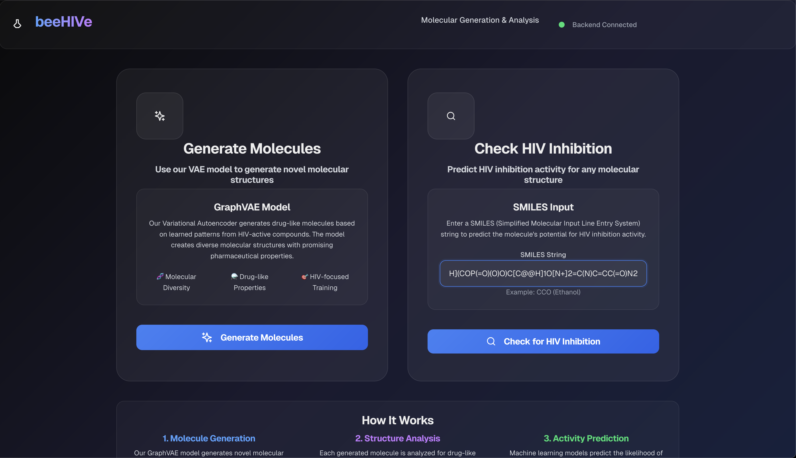
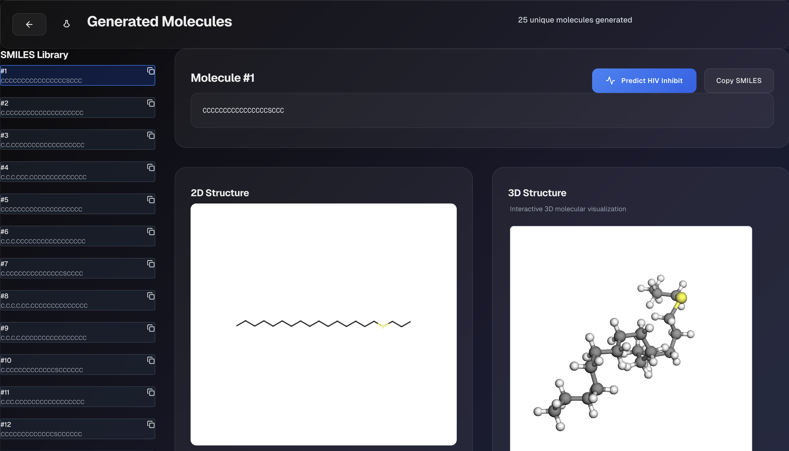

# beeHIVe: Multi-Modal Molecular Property Prediction

A full-stack application for molecular generation, visualization, and HIV activity prediction using machine learning.

This project implements and compares multiple state-of-the-art approaches including Graph Neural Networks (GNNs), Morgan Fingerprint MLPs, Structural Feature Models, and Graph Variational Autoencoders (VAEs) for molecular generation.

## Project Description

beeHIVe is an ensemble-based molecular property prediction system that combines different machine learning approaches to predict HIV activity of molecules. The project demonstrates the power of multi-modal learning by integrating:

- **Graph Neural Networks (GNNs)**: Utilizing GIN (Graph Isomorphism Network) and Hybrid architectures to learn from molecular graph representations
- **Morgan Fingerprint MLPs**: Traditional cheminformatics approach using molecular fingerprints as features
- **Structural Feature Models**: Both traditional ML ensembles and deep MLPs working on hand-crafted molecular descriptors
- **Graph VAE**: Generative model for creating new HIV-active molecules
- **Meta-Learning**: A stacked ensemble that combines predictions from all individual models

The framework is built on the OGB (Open Graph Benchmark) molhiv dataset and provides comprehensive training, evaluation, and inference capabilities.

## Project Structure

```
OverFiT/
├── main.py                     # Main ensemble model and training script
├── predict.py                  # Top-level prediction interface
├── GNNModels/                  # Graph Neural Network implementations
│   ├── main.py                 # GNN training and evaluation
│   ├── models.py               # GIN and Hybrid GNN architectures
│   ├── train.py                # Training loops and optimization
│   ├── predict.py              # GNN-specific prediction
│   ├── config.yaml             # GNN configuration parameters
│   └── models/                 # Trained GNN model weights
├── MorganFingerprintMLP/       # Morgan fingerprint-based MLP
│   ├── train.py                # MLP training with Morgan features
│   ├── models.py               # MLP architectures
│   ├── data_loader.py          # Feature extraction utilities
│   └── models/                 # Trained MLP weights
├── StructuralModels/           # Structural feature-based models
│   ├── main.py                 # Traditional ML and deep MLP training
│   ├── models.py               # ML ensemble and MLP implementations
│   ├── train.py                # Training functions
│   ├── predict.py              # Structural model predictions
│   └── models/                 # Trained model weights
├── GraphVAE/                   # Variational Autoencoder for molecule generation
│   ├── graphvae_molgen.py      # Graph VAE implementation
│   ├── vae_train.py            # VAE training script
│   └── vae_generate_molecule.py # Molecule generation utilities
├── Inference/                  # Inference utilities
│   └── gnn_predict.py          # SMILES to graph conversion
├── Complete/                   # Ensemble model outputs
│   └── meta_classifier.pth     # Trained meta-classifier weights
└── data/                       # Dataset storage
    └── ogbg_molhiv/            # OGB HIV dataset
└── docs/                       # Supporting documents
```

## Key Features

### 1. Mixture of Experts (MoE) Learning
- **Graph-based**: Learns directly from molecular graph structure using GNNs
- **Fingerprint-based**: Uses traditional Morgan fingerprints for chemical similarity
- **Feature-based**: Leverages hand-crafted molecular descriptors
- **Ensemble Integration**: Meta-classifier combines all approaches for improved performance

### 2. Flexible Model Architectures
- **GIN (Graph Isomorphism Network)**: State-of-the-art graph neural network
- **Hybrid GNN**: Combines multiple graph convolution types
- **Deep MLPs**: Fully connected networks for structured features
- **Traditional ML**: Random Forest, XGBoost ensemble methods

### 3. Comprehensive Evaluation
- **Multiple Metrics**: ROC-AUC, accuracy, precision, recall, F1-score
- **Cross-validation**: Robust model evaluation
- **Visualization**: Training curves and model comparison plots

### 4. Molecule Generation
- **Graph VAE**: Generates new molecules with desired properties
- **SMILES Processing**: Handles molecular string representations
- **Chemical Validity**: Ensures generated molecules are chemically reasonable

## Setup Instructions

### ML Environment Setup

1. **Clone the repository**:
   ```bash
   git clone https://github.com/declansam/OverFiT.git
   cd OverFiT
   ```

2. **Create a Python environment** (recommended Python 3.8+):
   ```bash
   # cuda 12.2 necessary
   ## option 1 (if using HPC)
   module load cuda/12.2.0 
   ## option 2: ensure cuda 12.2 is installed. Otherwise, the code will run in CPU.

   # env
   conda create --name beehive python=3.10
   conda activate beehive

   # installation from yaml file
   conda env update --file environment.yml
   ```

3. **Install core dependencies**:
   - A environment.yml file has been attached for conda environment setup.

### Web App

#### 🚀 Next.js Frontend (`overfit-app/`)

Modern web interface for molecular discovery and analysis.

**Quick Start:**

```bash
cd overfit-app
npm install
npm run dev
```

Visit `http://localhost:3000`

**Features:**

- Generate molecules using GraphVAE
- Visualize molecular structures
- Predict HIV activity
- Interactive 3D molecule viewer

### ⚡ FastAPI Backend (`fastapi-backend/`)

High-performance API server with machine learning endpoints.

**Quick Start:**

```bash
cd fastapi-backend
pip install -r requirements.txt
python run.py
```

API available at `http://localhost:8000`

**Endpoints:**

- `/api/generate-molecules` - Generate new molecules
- `/api/visualize-molecule` - Create molecular visualizations
- `/api/predict-hiv` - Predict HIV activity
- `/api/generate-3d-molecule` - Generate 3D structures

### Data Setup

The project uses the OGB HIV dataset which will be automatically downloaded on first run:

```bash
# The dataset will be downloaded
python GNNModels/main.py --mode demo
```

## Usage
```
NOTE: Once ML environment and web-app are setup, the functionalities are visbile on the web-app. Additinoally, training and inferece can be done from command line as describe in [1] and [2] here.
```



### 1. Training Individual Models

**Graph Neural Networks**:
```bash
cd GNNModels
python main.py --mode train --epochs 50 --model-type gin
python main.py --mode train --epochs 50 --model-type hybrid
```

**Morgan Fingerprint MLP**:
```bash
cd MorganFingerprintMLP
python train.py --epochs 100
```

**Structural Models**:
```bash
cd StructuralModels
python main.py --mode train_mlp --epochs 100
python main.py --mode train_ml
```

**Graph VAE**:
```bash
cd GraphVAE
python vae_train.py --epochs 200
```

### 2. Training the Ensemble Model

```bash
# Train the meta-classifier on pre-trained models
python main.py
```

### 3. Making Predictions & Molecule Generation
```
Refer to the web app setup instruction to use prediction feature in the web-app.
```


## Configuration

Each model component has its own configuration:

- **GNNModels/config.yaml**: GNN hyperparameters and training settings
- **StructuralModels/config.yaml**: Traditional ML and MLP parameters
- **main.py**: Ensemble model architecture and meta-learning setup

Key parameters can be adjusted for:
- Model architectures (hidden dimensions, layers, dropout)
- Training (learning rates, batch sizes, epochs)
- Data processing (feature extraction, molecular descriptors)


## Contributors
- [Avaneesh Devkota](https://github.com/avaneeshdevkota)
- [Samyam Lamichhane](https://github.com/declansam)
- [Sandhya Sharma](https://github.com/sandhya-sharrmma)
- [Sarthak Prasad Malla](https://github.com/Sarthak-Malla)


## License

This project is licensed under the MIT License - see the LICENSE file for details.
